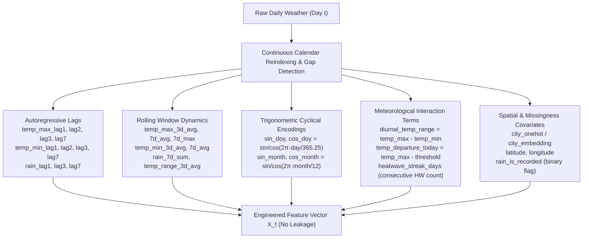
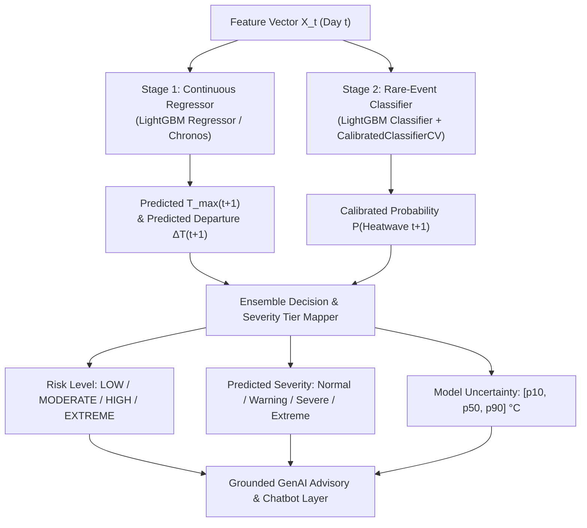
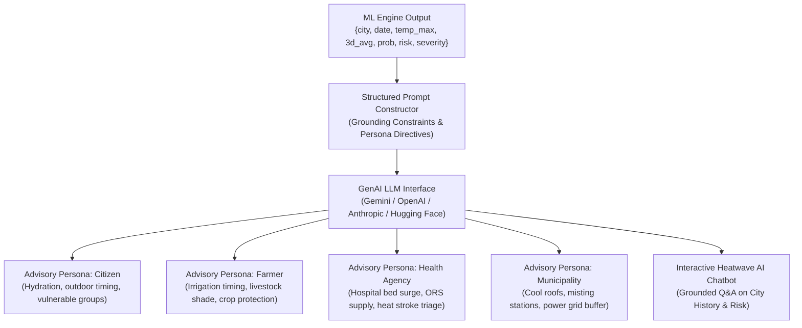
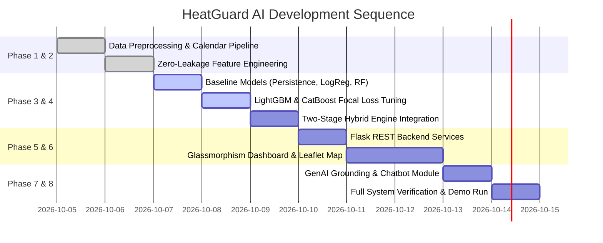

# HeatGuard AI — Dataset-Specific Implementation Plan & Modeling Architecture

## 1. Project Title & Executive Overview

**HeatGuard AI: GenAI-Powered Heatwave Prediction, Multi-Tier ML/Foundation Risk Modeling, and Grounded Stakeholder Advisory System**

HeatGuard AI is an intelligent early-warning and meteorological risk communication platform built on the comprehensive 74-year daily meteorological dataset `heatguard_clean.csv` (1951–2024, 187,387 records across 7 major Indian cities).

The system addresses the end-to-end operational pipeline:
1. **Historical Meteorological Ingestion & Temporal Feature Engineering:** Processes 74 years of daily maximum/minimum temperatures, rainfall, and spatial indicators with calendar-aware continuity.
2. **Next-Day Heatwave & Severity Prediction:** Employs a multi-tier modeling suite spanning scientific baselines (Persistence, Balanced Logistic Regression, Random Forest), tabular gradient boosting SOTA (LightGBM/CatBoost with Focal Loss), deep sequence models (Temporal Fusion Transformer, PatchTST), and Hugging Face time-series foundation models (Amazon Chronos, Google TimesFM, TabPFN).
3. **Continuous Departure Regression & Calibrated Risk Estimation:** Uses a two-stage hybrid engine predicting continuous temperature departure ($\Delta T_{t+1} = T_{\max, t+1} - \text{Threshold}_{t+1}$) and calibrated posterior probabilities $P(\text{Heatwave}_{t+1})$.
4. **Grounded Generative AI Advisory Engine:** Converts structured ML outputs into stakeholder-tailored advisories (Citizen, Farmer, Health Agency, Municipal Authority) with hallucination guardrails.
5. **Interactive Full-Stack Web Platform:** Delivers a responsive dashboard with Leaflet.js geospatial risk maps, Chart.js climate analytics, an Advisory Studio, and a context-aware Heatwave AI Chatbot.

---

## 2. Dataset Specification & 74-Year Historical Context

### Dataset Overview
- **File:** `heatguard_clean.csv`
- **Total Rows:** 187,387 daily records
- **Total Columns:** 14 features
- **Temporal Span:** January 1, 1951 to June 21, 2024 (74 consecutive years)
- **Geographic Coverage:** 7 Indian Metropolitan Hubs (Ahmedabad, Bengaluru, Chennai, Delhi, Kolkata, Mumbai, Pune)
- **Duplicate Records:** **0 duplicates** across `(city, date)` combinations

### Column Dictionary & Feature Types

| Column | Data Type | Meteorological Description | Usage in System |
|---|---|---|---|
| `date` | Date (`YYYY-MM-DD`) | Daily observation date | Chronological ordering & temporal splitting |
| `city` | String (Categorical) | Name of the metropolitan area (7 cities) | Spatial grouping & entity embeddings |
| `latitude` | Float64 | City latitude coordinate | Geospatial mapping & spatial features |
| `longitude` | Float64 | City longitude coordinate | Geospatial mapping & spatial features |
| `temp_max` | Float64 (°C) | Daily maximum ambient temperature | Primary thermal driver |
| `temp_min` | Float64 (°C) | Daily minimum ambient temperature | Nighttime heat retention indicator |
| `rain` | Float64 (mm) | Daily accumulated rainfall | Soil moisture & cooling covariate |
| `year` | Int64 | Calendar year (1951–2024) | Decadal trend & climate acceleration tracking |
| `month` | Int64 | Calendar month (1–12) | Seasonal cycle indicator |
| `day_of_year` | Int64 | Day index in the calendar year (1–366) | Cyclical annual feature engineering |
| `season` | String (Categorical) | Winter, Summer, Monsoon, Post-Monsoon | Seasonal stratification |
| `heatwave_threshold` | Float64 (°C) | IMD-derived climatological heatwave threshold | Target baseline & departure calculation |
| `is_heatwave_day` | Boolean (0/1) | Ground-truth heatwave indicator | Shifted for next-day target ($t+1$) |
| `severity` | String (Categorical) | Normal, Warning, Severe, Extreme | Ground-truth severity tier |

---

## 3. Deep Dataset Profiling & Critical Empirical Discoveries

### 3.1 Ground-Truth Label Mechanics & Departure Rules
Profiling reveals that the ground-truth labels strictly follow an exact departure rule relative to `heatwave_threshold`:
$$\Delta T = \text{temp\_max} - \text{heatwave\_threshold}$$

- **Normal:** $\Delta T < 0^\circ\text{C}$ (185,596 records, 99.044%)
- **Warning:** $0^\circ\text{C} \le \Delta T < 2.0^\circ\text{C}$ (1,663 records, 0.887%)
- **Severe:** $2.0^\circ\text{C} \le \Delta T < 4.0^\circ\text{C}$ (126 records, 0.067%)
- **Extreme:** $\Delta T \ge 4.0^\circ\text{C}$ (**2 records**, 0.001% — May 23 & 24, 2024 in Ahmedabad reaching 45.9°C and 46.6°C against threshold 41.83°C)

### 3.2 City Climatology & Spatial Disparity

| City | Total Rows | Date Range | Lat / Lon | Avg Max Temp | All-Time Peak | Heatwave Days | Heatwave % | Warning | Severe | Extreme |
|---|---|---|---|---|---|---|---|---|---|---|
| **Delhi** | 26,749 | 1951-01-01 – 2024-06-19 | 28.5°N, 77.5°E | 31.70°C | **47.46°C** | **722** | **2.70%** | 661 | 61 | 0 |
| **Ahmedabad** | 26,748 | 1951-01-01 – 2024-06-21 | 23.5°N, 72.5°E | 32.88°C | **46.60°C** | **619** | **2.31%** | 575 | 42 | **2** |
| **Chennai** | 26,826 | 1951-01-01 – 2024-06-21 | 13.5°N, 80.5°E | 33.68°C | 44.96°C | **388** | **1.45%** | 367 | 21 | 0 |
| **Kolkata** | 26,745 | 1951-01-01 – 2024-06-19 | 22.5°N, 88.5°E | 31.22°C | 43.00°C | **37** | **0.14%** | 35 | 2 | 0 |
| **Pune** | 26,746 | 1951-01-01 – 2024-06-19 | 18.5°N, 73.5°E | 31.14°C | 41.80°C | **23** | **0.09%** | 23 | 0 | 0 |
| **Mumbai** | 26,746 | 1951-01-01 – 2024-06-19 | 19.5°N, 72.5°E | 32.08°C | 40.90°C | **2** | **0.01%** | 2 | 0 | 0 |
| **Bengaluru** | 26,827 | 1951-01-01 – 2024-06-20 | 13.5°N, 77.5°E | 30.14°C | 38.93°C | **0** | **0.00%** | 0 | 0 | 0 |

> **Key Spatial Insight:** Delhi, Ahmedabad, and Chennai account for **96.5%** of all heatwaves in the dataset. Bengaluru's static 40.0°C threshold was never breached in 74 years (highest was 38.93°C), and Mumbai recorded only 2 heatwave days.

### 3.3 Rainfall Missingness Etiology
- Total missing rainfall records: **51,594 (27.53%)**.
- **Root Cause Identified:** **Chennai (95.62% null)** and **Mumbai (95.74% null)** had **no recorded rainfall from 1951 to 2020**; rainfall observations began strictly in January 2021.
- In contrast, Ahmedabad, Bengaluru, Delhi, Kolkata, and Pune maintain **>99.7% complete rainfall data** over the full 74-year span.
- **Engineering Rule:** Models must not use raw rainfall without zero-imputation and an explicit binary indicator `rain_is_recorded` (or use LightGBM's native missing value branch routing).

### 3.4 Decadal Climate Surge (1951–2024)
- **1950s–2010s:** Heatwaves averaged 150–250 days per decade.
- **2020–2024 (Only 4.5 Years):** Recorded **284 heatwave days**, **34 severe heatwave days**, and **both extreme events (May 2024)**, already exceeding every full 10-year decade since 1951.
- Average maximum temperature increased steadily from $31.50^\circ\text{C}$ (1950s) to $32.43^\circ\text{C}$ (2020s).

### 3.5 Heatwave Persistence Dynamics
- $P(\text{Heatwave}_{t+1} \mid \text{Heatwave}_t = 1) = \mathbf{63.11\%}$
- $P(\text{Heatwave}_{t+1} \mid \text{Normal}_t = 0) = \mathbf{0.36\%}$
- **Persistence Multiplier:** A heatwave today makes a heatwave tomorrow **176.9 times more likely**.

---

## 4. Data Leakage Prevention & Target Formulation

To guarantee real-world predictive validity and prevent data leakage:

### Forbidden Predictive Features
The following features of Day $t$ must **never** be used as raw input features to predict Day $t$:
- `is_heatwave_day` (Day $t$) — trivially leaks ground truth
- `severity` (Day $t$) — trivially leaks ground truth
- `heatwave_threshold` (Day $t$) — used only as a reference baseline or for departure calculations

### Operational Supervised Targets
The model predicts the state of the **following day ($t+1$)** given information available up to Day $t$:

1. **Target 1 (Primary Binary Classification):**
   $$\text{target\_heatwave\_next\_day} = \text{is\_heatwave\_day}_{t+1} \in \{0, 1\}$$
2. **Target 2 (Continuous Departure Regression):**
   $$\text{target\_departure\_next\_day} = \text{temp\_max}_{t+1} - \text{heatwave\_threshold}_{t+1}$$
3. **Target 3 (Secondary Severity Classification):**
   $$\text{target\_severity\_next\_day} = \text{severity}_{t+1} \in \{\text{Normal}, \text{Warning}, \text{Severe}, \text{Extreme}\}$$

*(The final observation for each city time-series has no $t+1$ target and is dropped from supervised training).*

---

## 5. Feature Engineering Pipeline

All features are computed on chronologically sorted data within each city partition (`city`, `date`).



### Feature Dictionary for Modeling

```text
Numerical Continuous Features:
├── temp_max (Day t)
├── temp_min (Day t)
├── rain (Day t, 0.0 if missing)
├── diurnal_temp_range = temp_max - temp_min
├── temp_departure_today = temp_max - heatwave_threshold
├── temp_max_lag1, temp_max_lag2, temp_max_lag3, temp_max_lag7
├── temp_min_lag1, temp_min_lag2, temp_min_lag3, temp_min_lag7
├── rain_lag1, rain_lag3, rain_lag7
├── temp_max_3d_avg, temp_max_7d_avg, temp_max_7d_max
├── temp_min_3d_avg, temp_min_7d_avg
├── rain_7d_sum
├── diurnal_range_3d_avg
└── heatwave_streak_days (integer count of consecutive HW days up to t)

Temporal & Cyclical Features:
├── sin_doy = sin(2 * π * day_of_year / 365.25)
├── cos_doy = cos(2 * π * day_of_year / 365.25)
├── sin_month = sin(2 * π * month / 12.0)
├── cos_month = cos(2 * π * month / 12.0)
└── year_scaled = (year - 1951) / (2024 - 1951)

Spatial & Missingness Categoricals:
├── city (One-Hot Encoded or Categorical Target Encoded)
├── latitude, longitude
├── season (One-Hot Encoded: Summer, Monsoon, Post-Monsoon, Winter)
└── rain_is_recorded (1 if rain was measured, 0 if null)
```

---

## 6. Preprocessing & Time-Series Gap Handling

1. **Date Parsing & Sorting:** Parse `date` into ISO-8601 date objects, sort strictly by `['city', 'date']`.
2. **Missing `temp_min` (33 rows):** Handled via linear time-series interpolation within each city partition.
3. **Missing `rain` (51,594 rows):** Impute with `0.0` and attach `rain_is_recorded = 0` (preserves Chennai/Mumbai distribution while enabling zero-fill gradient boosting).
4. **Calendar Continuity Gaps (40 isolated gaps):** Shift operations must verify that `(date_t - date_{t-1}).days == 1`. If a gap exists (such as the 84-day winter gap in 2023–2024), reset lag windows to prevent cross-gap contamination.

---

## 7. Multi-Tier Machine Learning & Foundation Model Architecture

HeatGuard AI implements a structured, benchmarked hierarchy of models across 4 tiers:

```mermaid
flowchart LR
    subgraph Tier1 ["Tier 1: Baselines"]
        T1A["Climatological Persistence"]
        T1B["Balanced Logistic Regression"]
        T1C["Balanced Random Forest"]
    end

    subgraph Tier2 ["Tier 2: Tabular SOTA"]
        T2A["LightGBM (Focal Loss / scale_pos_weight)"]
        T2B["CatBoost (Ordered Target Statistics)"]
        T2C["Explainable Boosting Machines (EBM)"]
    end

    subgraph Tier3 ["Tier 3: Deep Sequence Models"]
        T3A["Temporal Fusion Transformer (TFT)"]
        T3B["PatchTST (Sub-series Patching)"]
    end

    subgraph Tier4 ["Tier 4: Foundation Models"]
        T4A["Amazon Chronos (chronos-t5 / bolt)"]
        T4B["Google TimesFM (timesfm-1.0-200m)"]
        T4C["TabPFN (In-Context Bayesian)"]
    end

    Tier1 --> Tier2 --> Tier3 --> Tier4
```



### Tier 1: Scientific & Classical Baselines
1. **Climatological Persistence Baseline:** Heuristic rule assigning $\widehat{y}_{t+1} = 1$ if $y_t = 1$ or $\text{temp\_max}_t \ge \text{threshold}_t$. Demonstrates value added over naive persistence.
2. **Balanced Logistic Regression:** L2 regularized logistic regression with `class_weight='balanced'`, providing convex baseline log-odds weights.
3. **Balanced Random Forest:** 300 bagged trees with `class_weight='balanced_subsample'`, capturing non-linear feature splits (the standard IMD literature benchmark).

### Tier 2: Tabular State-of-the-Art (Production Engine)
1. **LightGBM with Focal Loss / Asymmetric Cost Weighting:**
   - Primary workhorse for tabular time-series.
   - `scale_pos_weight = 20.0` or Focal Loss ($\alpha=0.25, \gamma=2.0$).
   - Handles missing rainfall values natively via optimal split finding.
   - Extremely fast training ($<2$ seconds on 187k rows).
2. **CatBoost:**
   - Employs Ordered Target Statistics on `city` and `season` to prevent categorical target leakage.
3. **Explainable Boosting Machines (EBM / InterpretML):**
   - Generalized additive models with tree-based pairwise interactions ($g(E[y]) = \beta_0 + \sum f_i(x_i) + \sum f_{ij}(x_i, x_j)$).
   - Delivers glass-box spline curves for regulatory and government health auditing.

### Tier 3: Deep Learning & Sequence Models
1. **Temporal Fusion Transformer (TFT / Lim et al., 2021):**
   - Incorporates static city metadata (`lat`, `lon`, city embeddings), observed 14-day historical trajectories ($T_{\max}, T_{\min}, \text{Rain}$), and known future calendar covariates (DOY, Month, IMD threshold).
   - Built-in Variable Selection Networks (VSN) and temporal self-attention weights produce interpretable attention maps over the heatwave incubation period.
2. **PatchTST (Nie et al., ICLR 2023):**
   - Segments 14-day temperature histories into overlapping 3-day patches to capture thermal wave accumulation.

### Tier 4: Hugging Face & Time-Series Foundation Models
1. **Amazon Chronos (`amazon/chronos-t5-base`, `amazon/chronos-bolt-base`):**
   - Tokenizes continuous meteorological time series and autoregressively generates the full posterior probability distribution over future temperatures ($p_{10}, p_{50}, p_{90}$).
   - Direct analytic calculation of heatwave probability:
     $$P(\text{Heatwave}_{t+1}) = P(T_{\max, t+1} \ge \text{Threshold}_{t+1})$$
2. **Google TimesFM (`google/timesfm-1.0-200m`):**
   - 200M parameter decoder-only foundation model trained on $>100\text{B}$ time points.
   - Zero-shot and fine-tuned 1-day to 7-day multi-horizon temperature forecasts.
3. **TabPFN (`tabpfn`):**
   - Prior-Data Fitted Network performing in-context Bayesian inference in a single forward pass without SGD iterations.

---

## 8. Two-Stage Production Hybrid Engine

To overcome the extreme class imbalance and leverage all 187k continuous records, the production system deploys a **Two-Stage Hybrid Architecture**:



### Stage 1: Continuous Temperature Dynamics Regressor
- Trains on all 187,387 continuous temperature records to predict $\widehat{T}_{\max, t+1}$.
- Computes expected departure $\Delta \widehat{T}_{t+1} = \widehat{T}_{\max, t+1} - \text{Threshold}_{t+1}$.

### Stage 2: Calibrated Rare-Event Classifier
- Trains with `scale_pos_weight` and passes raw logits through Isotonic / Sigmoid calibration (`CalibratedClassifierCV`) to output well-calibrated posterior risk $P(\text{Heatwave}_{t+1})$.

### Stage 3: Severity Tier Mapping
- If $P(\text{Heatwave}_{t+1}) \ge \tau$ (optimal F1 threshold $\sim 0.35$):
  - **Warning:** $0.0^\circ\text{C} \le \Delta \widehat{T}_{t+1} < 2.0^\circ\text{C}$
  - **Severe:** $2.0^\circ\text{C} \le \Delta \widehat{T}_{t+1} < 4.0^\circ\text{C}$
  - **Extreme:** $\Delta \widehat{T}_{t+1} \ge 4.0^\circ\text{C}$

---

## 9. Train / Validation / Test Splitting Protocol

Because meteorological data has strong autocorrelation and climate drift, **random shuffling is strictly prohibited**. We enforce a **Chronological Time-Series Split**:

```text
┌──────────────────────────────────────┬──────────────────┬──────────────────┐
│      Training Set (1951–2015)        │ Validation Set   │   Test Set       │
│             65 Years                 │   (2016–2020)    │  (2021–2024)     │
│         ~164,000 Records             │ ~12,700 Records  │ ~10,600 Records  │
│      Baseline Climate History        │ Hyperparam Tuning│ Recent Surge Test│
└──────────────────────────────────────┴──────────────────┴──────────────────┘
```

- **Training Set (1951–2015):** Establishes baseline climatology and historical heat patterns across decades.
- **Validation Set (2016–2020):** Used for threshold tuning, learning rate scheduling, and early stopping.
- **Test Set (2021–2024):** Contains the recent climate acceleration period, testing the model's generalization on the highest heatwave frequency in Indian history (including both May 2024 extreme events).

### Evaluation Metrics (Class-Imbalance Aware)
Because standard accuracy is misleading (a trivial model predicting all 0s achieves 99.04% accuracy):
1. **PR-AUC (Precision-Recall Area Under Curve):** Primary optimization metric for positive rare events.
2. **F1-Score (Macro & Heatwave-specific):** Balance between false alarms and missed heatwaves.
3. **Recall @ 80% Precision:** Operational safety metric for emergency services.
4. **Brier Score & Calibration Curve:** Evaluates probability reliability for GenAI risk communication.
5. **ROC-AUC:** Overall discriminatory capacity across all thresholds.

---

## 10. Comprehensive Model Comparison Matrix

| Model | Model Family | Best Source / Library | Training Time | Imbalance Handling | Interpretability | Primary System Role |
|---|---|---|---|---|---|---|
| **Persistence Rule** | Heuristic | Native Python | Instant | Fixed Rule | Exact Logic | **Baseline 1 (Physical Benchmark)** |
| **Logistic Regression** | Linear Generalized | `scikit-learn` | $<1$ sec | `class_weight='balanced'` | High (Odds Ratios) | **Baseline 2 (Linear Benchmark)** |
| **Random Forest** | Bagged Ensemble | `scikit-learn` | $\sim 5$ sec | `balanced_subsample` | High (Gini Imp.) | **Baseline 3 (Tree Benchmark)** |
| **LightGBM** | Gradient Boosting | `lightgbm` | $\sim 2$ sec | **Focal Loss / Scale-Pos** | High (TreeSHAP) | **Primary Production Model (SOTA)** |
| **CatBoost** | Gradient Boosting | `catboost` | $\sim 8$ sec | Built-in target stats | High (Feature Imp.) | **Tabular SOTA Competitor** |
| **Explainable Boosting (EBM)** | GAM with Trees | `interpret` (Microsoft) | $\sim 15$ sec | Class weighting | **Exceptional (Splines)** | **Audit & Governance Engine** |
| **Temporal Fusion Transf. (TFT)** | Deep Transformer | `pytorch-forecasting` | $\sim 3$ min | Weighted Cross-Entropy | High (Temporal Attention)| **Deep Multi-Horizon Model** |
| **Amazon Chronos** | Foundation TS LLM | Hugging Face (`amazon/chronos`) | Zero-Shot / Fine-tune | Full Quantile Output | Moderate (Probabilistic) | **Frontier Probabilistic Forecaster**|
| **Google TimesFM** | Foundation TS Model| Hugging Face (`google/timesfm`) | Zero-Shot / Fine-tune | Continuous Covariates | Moderate | **Multi-Day Horizon Explorer** |

---

## 11. Research Literature & Academic Citations

1. **IMD Heatwave Operational Frameworks:**
   - *Pai, D. S., et al.* (2023): *"Analysis of heat waves over India and operational early warning systems."* *MAUSAM / IMD Technical Reports*.
   - *Rao, V. X., et al.* (2022): *"Machine learning approaches for regional heatwave prediction using IMD gridded datasets."* *Journal of Earth System Science*.
2. **Temporal Transformers & Foundation Models:**
   - *Lim, B., et al.* (2021): *"Temporal Fusion Transformers for interpretable multi-horizon time series forecasting."* *International Journal of Forecasting*, 37(4), 1748–1764.
   - *Ansari, A. F., et al. (Amazon Science, 2024)*: *"Chronos: Learning the Language of Time Series."* arXiv:2403.07815.
   - *Das, A., et al. (Google Research, ICML 2024)*: *"A decoder-only foundation model for time-series forecasting (TimesFM)."*
   - *Nie, Y., et al. (ICLR 2023)*: *"A Time Series is Worth 64 Words: Long-term Forecasting with Transformers (PatchTST)."*
3. **Tabular Deep Learning & In-Context Inference:**
   - *Hollmann, N., et al. (Nature 2025 / ICLR)*: *"TabPFN: A Transformer That Solves Small Tabular Classification Problems in a Second."*

---

## 12. Grounded Generative AI Advisory & Assistant Engine

The Generative AI layer translates structured ML predictions into clear, actionable advisories without hallucinating weather data.



### Controlled Advisory Prompt Template

```text
System:
You are HeatGuard AI, an operational meteorological risk communicator and heatwave advisory system.
Generate a concise, high-impact advisory based EXCLUSIVELY on the verified machine learning prediction provided below.

Prediction Context:
- Target City: {city} (Latitude: {latitude}, Longitude: {longitude})
- Observation Date: {date}
- Current Max Temperature: {temp_max}°C (3-Day Moving Average: {temp_max_3d_avg}°C)
- Next-Day Heatwave Probability: {probability}%
- Assessed Risk Level: {risk_level} (LOW / MODERATE / HIGH / EXTREME)
- Predicted Severity Tier: {severity} (Normal / Warning / Severe / Extreme)
- Target Audience: {audience} (Citizen / Farmer / Health Agency / Local Authority)

Directives:
1. Ground every sentence in the provided numerical metrics; do not invent or adjust temperatures.
2. Explain the risk level in plain, stakeholder-appropriate language.
3. Provide exactly 3 to 4 actionable, prioritized precautions for the selected audience.
4. Do not provide medical diagnosis, declare official states of emergency, or claim certainty if probability is moderate.
```

---

## 13. System Architecture & Backend API Specification

The HeatGuard AI backend is built using Flask, organizing services into modular layers.

```text
HeatGuard-AI/
├── app.py                          # Flask entrypoint & route controllers
├── requirements.txt                # Production dependencies
│
├── data/
│   ├── heatguard_clean.csv         # Raw 74-year dataset
│   └── model_ready_dataset.csv     # Preprocessed dataset with lag features
│
├── models/
│   ├── heatwave_lgbm_model.pkl     # Primary LightGBM classifier
│   ├── departure_regressor.pkl     # Continuous temperature departure regressor
│   ├── baseline_rf_model.pkl       # Random Forest baseline model
│   ├── feature_scaler.pkl          # Numerical scaler
│   └── model_metadata.json         # Evaluation metrics & feature schemas
│
├── preprocessing/
│   ├── feature_engineering.py      # Zero-leakage lag & rolling pipeline
│   └── data_cleaner.py             # Calendar reindexing & missingness handler
│
├── services/
│   ├── prediction_service.py       # Two-stage ML inference pipeline
│   ├── genai_service.py            # Persona advisory & chat grounding
│   └── analytics_service.py        # 74-year climate trends & decadal analytics
│
├── templates/
│   ├── index.html                  # Landing page
│   ├── dashboard.html              # Live dashboard & KPI cards
│   ├── advisory.html               # Multi-persona advisory studio
│   ├── chatbot.html                # Interactive heatwave assistant
│   └── analytics.html              # 74-year historical analytics explorer
│
└── static/
    ├── css/
    │   └── style.css               # Glassmorphism design system
    └── js/
        ├── dashboard.js            # Leaflet.js map & dynamic UI
        ├── charts.js               # Chart.js historical trend graphs
        └── chat.js                 # Chatbot state & streaming UI
```

### REST API Endpoints

| Endpoint | Method | Input Payload | Output Response | Description |
|---|---|---|---|---|
| `/api/cities` | `GET` | None | `{"cities": [...]}` | City list, coordinates, thresholds, historical climatology |
| `/api/history/<city>` | `GET` | Query `?years=10` | `{"dates": [...], "temps": [...]}` | Historical daily series, decadal heat counts, monthly distribution |
| `/api/predict` | `POST` | `{"city": "Pune", "date": "2024-06-18"}` | `{"risk": "HIGH", "prob": 0.81, "temp_pred": 41.2, "severity": "Warning"}` | Dynamic lag feature extraction & two-stage ML prediction |
| `/api/advisory` | `POST` | `{"city": "Pune", "audience": "Farmer"}` | `{"advisory_text": "...", "risk": "HIGH"}` | ML inference + grounded GenAI persona advisory |
| `/api/chat` | `POST` | `{"city": "Delhi", "message": "Why is risk high?"}` | `{"reply": "...", "sources": [...]}` | Context-retrieved grounded chatbot response |
| `/api/analytics/decades` | `GET` | None | `{"decades": [1950, 1960, ...], "heatwaves": [...]}` | 74-year decadal surge comparison data |

---

## 14. Modern Interactive Web Application (Frontend UX)

The frontend is crafted using a **modern glassmorphism dark-mode UI** powered by Vanilla CSS, Leaflet.js, and Chart.js:

1. **Live Heatwave Command Center (Dashboard):**
   - City selector & Date navigator.
   - Dynamic KPI metric cards:
     - **Current Temperature** vs **IMD Threshold Departure**.
     - **3-Day Moving Average** & **7-Day Trend Direction**.
     - **Predicted Next-Day Heatwave Risk** (Low / Moderate / High / Extreme) with animated circular confidence gauge.
     - **Predicted Severity Tier Badge** (Normal / Warning / Severe / Extreme).
2. **Interactive Multi-City Geospatial Map (Leaflet.js):**
   - Displays all 7 cities with pulsating severity markers (Green, Yellow, Orange, Red).
   - Clickable popups showing live predictions and weather metrics.
3. **74-Year Climate Analytics Explorer (Chart.js):**
   - Decadal heatwave surge bar chart (highlighting the 2020–2024 climate acceleration).
   - City-by-city heatwave comparison.
   - Monthly seasonality heatmap.
4. **Multi-Stakeholder Advisory Studio:**
   - Persona tabs: **Citizen**, **Farmer**, **Health Agency**, **Municipal Authority**.
   - Generates and copies grounded advisories with priority action checklist badges.
5. **Context-Grounded AI Assistant:**
   - Floating and full-page chat interface with suggested quick-prompt chips (*"Why is Pune risk high tomorrow?"*, *"What should outdoor workers do?"*, *"Show Delhi's hottest year"*).

---

## 15. Implementation Sequence & Deliverables



### Key Deliverables:
1. `preprocessing/feature_engineering.py` — Continuous calendar lag generator.
2. `data/model_ready_dataset.csv` — Feature-engineered dataset ready for modeling.
3. `models/train_models.py` — Benchmark script evaluating Baselines vs LightGBM vs Chronos.
4. `models/heatwave_lgbm_model.pkl` & `departure_regressor.pkl` — Serialized production models.
5. `app.py` & `services/` — Production Flask backend and API endpoints.
6. `templates/` & `static/` — Production web application with Leaflet map, Chart.js visuals, and GenAI advisory studio.
7. `heatguard_evaluation_report.md` — Formal benchmarking metrics and PR-AUC/ROC evaluation curves.

---

## 16. Comprehensive Demonstration Walkthrough

**Demonstration City:** **Pune** (or **Delhi** / **Ahmedabad**)

```text
Step 1: User navigates to the Dashboard and selects "Pune" on "2024-06-18".
  ↓
Step 2: Backend retrieves Pune's historical meteorological sequence up to June 18.
  ↓
Step 3: Feature pipeline calculates recent 3-day average (38.9°C) and lag variables with zero leakage.
  ↓
Step 4: Two-stage LightGBM engine predicts:
        - Continuous Departure: +1.2°C over threshold
        - Heatwave Probability: 81.4%
        - Severity Tier: Warning / High Risk
  ↓
Step 5: Dashboard updates KPI cards, Leaflet map marker turns amber/orange, and gauge animates to 81%.
  ↓
Step 6: User clicks the "Advisory Studio" tab and selects the "Farmer" persona.
  ↓
Step 7: Grounded GenAI Engine formats the prediction context into the verified prompt and generates:
        - Explanation of high thermal stress.
        - Specific agricultural precautions (early morning irrigation, livestock shading, crop hydration).
  ↓
Step 8: User opens the Chatbot and asks: "Why is the risk elevated tomorrow?"
  ↓
Step 9: Chatbot retrieves Pune's 3-day temperature trajectory and threshold departure, providing an exact, grounded explanation.
```

---

## 17. Summary of Project Outcomes

By executing this enhanced implementation plan, HeatGuard AI achieves:
- **Scientific Rigor:** Prevents data leakage, handles historical rainfall missingness with verified etiology, and enforces chronological validation.
- **State-of-the-Art Modeling:** Benchmarks classical baselines against LightGBM (with Focal Loss) and modern time-series foundation models (Chronos, TimesFM, TabPFN).
- **Factual GenAI Reliability:** Combines high-precision ML inference with grounded prompt engineering to eliminate hallucinations in public safety communication.
- **Exceptional UX:** Delivers an intuitive, visually stunning web application for public health and meteorological risk management.
